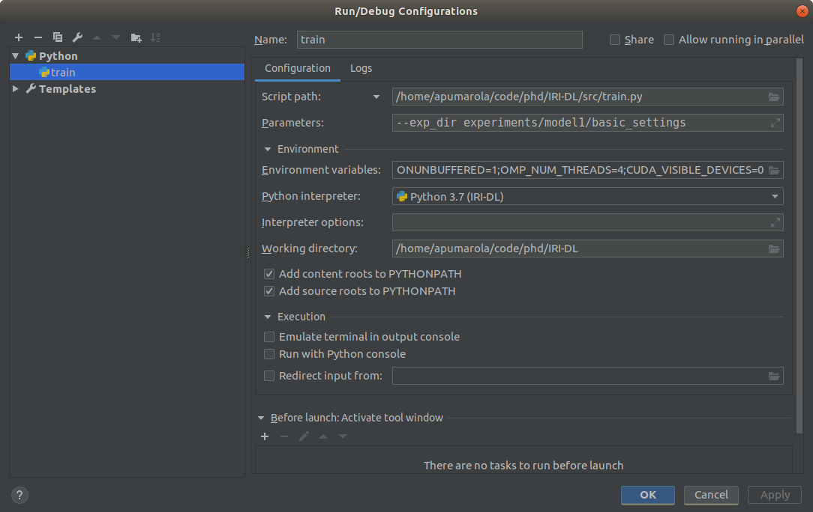
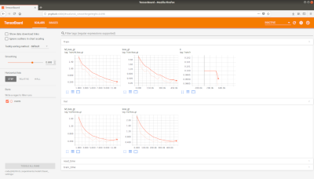
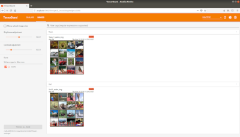

# IRI-DL

IRI deep learning project example. This repo contains the code structure I use for all my research. I designed it with the purpose of having a generic framework in which new research ideas could be quickly evaluated. For this particular repo, as an example, the framework has been configured to solve object classification. 

If you have any doubt do not hesitate to contact me at `apumarola@iri.upc.edu`.

#### 0. System
Upgrade system:
```
sudo apt-get update
sudo apt-get upgrade
```
#### 1. Nvidia Driver 
```
sudo apt install nvidia-384*
sudo reboot
```
#### 2. MiniConda
1. Download miniconda from the oficial [website](https://conda.io/miniconda.html). (Recommended: Python 3.* , 64-bits)
2. Install miniconda. (Recommended: use predefined paths and answer yes whenever you are asked yes/no)
    ```
    bash ~/Downloads/Miniconda3-latest-Linux-x86_64.sh
    ```
#### 3. Dependencies
1. Create and activate conda environment for the project
    ```
    conda create -n IRI-DL
    source activate IRI-DL
    ```
2. Install Pytorch
    ```
    conda install pytorch torchvision -c pytorch
    ```
3. Install other rand dependencies
    ```
    conda install matplotlib opencv pillow scikit-learn scikit-image cython tqdm
    pip install tensorboardX
    ```
4. Deactivate environment
    ```
    conda deactivate
    ```
#### 4. Tensorboard
1. Create and activate conda environment for tensorboard: 
    ```
    conda create -n tensorboard python=3.6
    source activate tensorboard
    ```
2. Install Tensorflow CPU
    ```
    pip install tensorflow
    ```
3. Deactivate environment
    ```
    conda deactivate
    ```
## Set code
Simply clone the repo:
```
cd /path/to/desired/folder/
git clone https://github.com/albertpumarola/IRI-DL.git
```

## Set IDE
1. Install PyCharm *Professional* from the official [website](https://www.jetbrains.com/pycharm/download/#section=linux) using your academic email.
2. Open Project: `Open->path/to/repo/`
3. Create desktop entry: `Tools->Create Desktop Entry...`
4. Set interpreter. In `File->Settings->Project: IRI-DL->Project Interpreter->gear->Add->Conda Environment->Existing environment:` set path to the created environment `~/miniconda3/envs/IRI-DL/bin/python`.


## Run train
1. Add configuration. In the top right `Add Configuration...->+->Python`. Introduce:
    * Name: `train`
    * Script Path: `path/to/repo/src/train.py`
    * Parameters: `--exp_dir experiments/model1/basic_settings`
    * Environment Variables:
        * `PYTHONUNBUFFERED 1`
        * `OMP_NUM_THREADS 4`
        * `CUDA_VISIBLE_DEVICES 0`
    * Python Interpreter: `Python 3.7(IRI-DL)`
    * Working Directory: `path/to/repo/`
    
    <p align="center">
      
    </p>

2. To run train simply press play button. If you prefer running in terminal you can launch 
    ```
    . experiments/prepare_session.sh 0
    ``` 
    to set environment variables and then run 
    ```
    python src/train.py --exp_dir experiments/model1/basic_settings
    ```
3. To visualize. In a new terminal run:
    ```
    source activate tensorboard
    tensorboard --logdir path/to/repo/experiments/model1/basic_settings/
    ```
5. To run other experiments simply change the experiment dir (e.g. `experiments/model1/with_vgg_lower_lr`)

<p align="center">
  
   
</p>

## Run test
1. Add configuration. In the top right `Add Configuration...->+->Python`. Introduce:
    * Name: `test`
    * Script Path: `path/to/repo/src/test.py`
    * Parameters: `--exp_dir experiments/model1/basic_settings`
    * Environment Variables:
        * `PYTHONUNBUFFERED 1`
        * `OMP_NUM_THREADS 1`
        * `CUDA_VISIBLE_DEVICES 0`
    * Python Interpreter: `Python 3.7(IRI-DL)`
    * Working Directory: `path/to/repo/`
2. To run test simply press play button. If you prefer running in terminal you can launch
    ```
    . experiments/prepare_session.sh 0
    ```
    to set environment variables and then run 
    ```
    python src/test.py --exp_dir experiments/model1/basic_settings
    ```
    results will be store in `experiments/model1/basic_settings/test`
3. To test other experiments simply change the experiment dir (e.g. `experiments/model1/with_vgg_lower_lr`)
